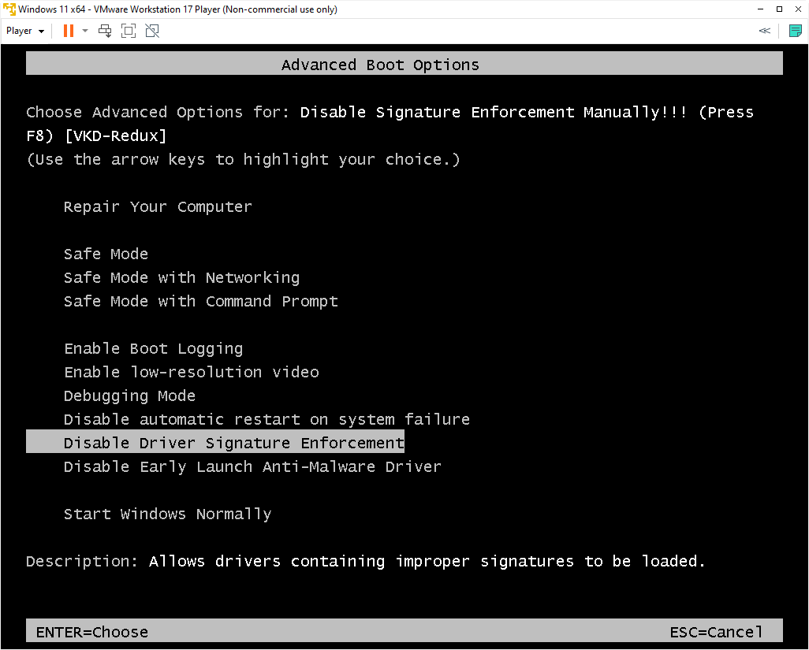

# Setting up kernel mode debugging

### Tools Used:

- [WinDbg](https://learn.microsoft.com/en-us/windows-hardware/drivers/debugger/debugging-using-windbg-preview)
- [VMware](https://www.vmware.com/in/products/workstation-player.html)
- [VirtualKD-Redux](https://github.com/4d61726b/VirtualKD-Redux)

## Steps

*All steps are to be executed in Administrative CMD*

🟢 - Host

🔵 - VM

- 🟢 Disable Memory integrity 
- 🟢 Run `bcdedit /set hypervisorlaunchtype off`
- 🟢 Install [VMware](https://www.vmware.com/in/products/workstation-player.html)
- [Download Windows](https://www.microsoft.com/software-download/windows11) and follow any tutorial to set up a windows
  VM (You might want to configure space to be around 50GB+, ram around 4GB, enable hardware acceleration and so on)
    - 🔵 You can skip Microsoft sign in by using banned email id, eg: use `no@thankyou.com` and type in any password, you
      should now be able to skip the sign-in process
    - 🔵 Install `VMware tools`
    - 🔵 Right click on `Start` and click on `Run`
        - 🔵 Type in `regedit`
        - 🔵 Now goto `HKEY_LOCAL_MACHINE\SYSTEM\CurrentControlSet\Control\Session Manager`
        - 🔵 Right click on `Session Manager -> New -> Key`
        - 🔵 Rename the new key to `Debug Print Filter` and select it
        - 🔵 Right-click the left column blank space and choose `New -> DWORD (32-bit) Value`
        - 🔵 Rename it to `DEFAULT`
        - 🔵 Double click and change its value to `ffffffff` 
    - 🟢 Now download [driver loader](https://www.osronline.com/article.cfm%5Earticle=157.htm)
        - 🟢 Extract it
        - 🔵 Drag and drop `"..\osrloaderv30\Projects\OsrLoader\kit\WLH\AMD64\FRE\OSRLOADER.exe"` to VM
- Next we move on to [VirtualKD-Redux](https://github.com/4d61726b/VirtualKD-Redux)
    - You can follow
      the [tutorial here](https://github.com/4d61726b/VirtualKD-Redux/blob/master/VirtualKD-Redux/Docs/Tutorial.md)
    - 🔵 `F8` bcdedit/debug and Select `Disable Driver Sig...` 
    - 🟢 Now open `vmmon64.exe` as administrator
    - 🔵 Now open the windows VM machine, if you have followed correctly then you WinDbg should launch automatically and
      windows boot-up should halt till you `Debug -> Go` in WinDbg
    - 🟢 Now goto `Debug -> Break`, followed by `File -> Symbol File Path ...` and
      put `SRV*c:\symbols* http://msdl.microsoft.com/download/symbols`, click on `Reload` and
      then `Ok` , finally `Debug -> Go`
    - 🔵 If this does not work, then in an elevated Command Prompt window, enter: `bcdedit /debug on`
      and `bcdedit /dbgsettings serial debugport:2 baudrate:115200`, you might have to change debug port to `1`
    - 🟢 You can also space this workspace in WinDbg by `File -> Save Workspace As...`
- 🟢 Goto `Debug -> Break`, followed by `File -> Symbol File Path ...` and
  put `C:\Users\sn99\CLionProjects\fsfilter-rs\minifilter\x64\Debug` or wherever the `.pdb` file is (this should be in
  the same build folder as `.sys` driver file), click on `Reload` and then `Ok`,
  finally `Debug -> Go` , and then `File -> Save Workspace`

## References

- [Windows Kernel Programming Tutorial 1 - Setting up Environment - Part 1](https://youtu.be/XUlbYRFFYf0)
- [Windows Kernel Programming Tutorial 2 - Setting up Environment - Part 2](https://youtu.be/nF3aYhmfL-0)
- [Debugging Tools for Windows (WinDbg, KD, CDB, NTSD)](https://learn.microsoft.com/en-us/windows-hardware/drivers/debugger/)
- [Microsoft public symbol server](https://learn.microsoft.com/en-us/windows-hardware/drivers/debugger/microsoft-public-symbols)
- [Get started with WinDbg (kernel-mode)](https://learn.microsoft.com/en-us/windows-hardware/drivers/debugger/getting-started-with-windbg--kernel-mode-)
- [Windbg always show "Waiting to reconnect..."](https://social.msdn.microsoft.com/Forums/Windows/en-US/2332bc93-c618-41f2-8be1-1e72d8089d23/windbg-always-show-quotwaiting-to-reconnectquot?forum=wdk)
- [VirtualKD-Redux Tutorial](https://github.com/4d61726b/VirtualKD-Redux/blob/master/VirtualKD-Redux/Docs/Tutorial.md)
- [Driver Loader](https://www.osronline.com/article.cfm%5Earticle=157.htm)