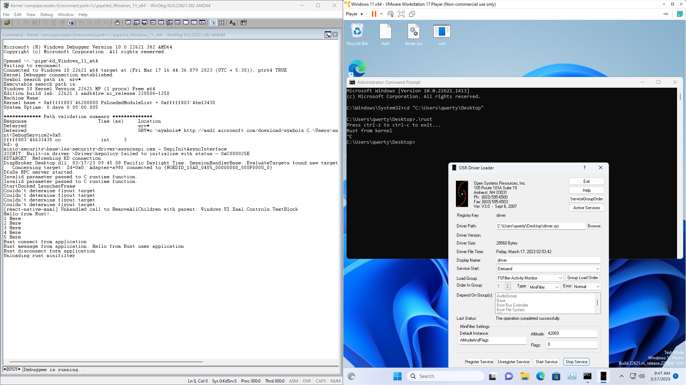

# Rust Minifilter POC

A simple minifilter that informs about currently open files in Rust

**Also see [fsfilter-rs](https://github.com/SubconsciousCompute/fsfilter-rs) that has minifilter interacting with
userspace Rust application**

## Prerequisites

- [Rust](https://www.rust-lang.org/)
- [Microsoft Visual Studio](https://visualstudio.microsoft.com/)
- [Windows SDK](https://developer.microsoft.com/en-us/windows/downloads/windows-sdk/)
- [Windows Driver Kit](https://learn.microsoft.com/en-us/windows-hardware/drivers/download-the-wdk)
- [LLVM and Clang (for bindgen)](https://releases.llvm.org/download.html)
- [Cargo Make](https://github.com/sagiegurari/cargo-make)

It is best if you
follow [Codentium - Windows Drivers in Rust: Prerequisites](https://codentium.com/guides/windows-dev/windows-drivers-in-rust-prerequisites/).

You can set up a VM for testing by following [DEBUG](DEBUG.md).

## Building

From inside [windows-rust-minifilter](windows-rust-minifilter), run:

`cargo make --profile production all`

**Note: You might need to run `cargo clean` before rebuilding again.**

## Loading and Running

You can use [OsrLoader](https://www.osronline.com/article.cfm%5Earticle=157.htm) to load the Minifilter (Ideally I
should make an `.inf` file but lazy thimes)

- Set type to `minifilter`
- Load Group to `FSFilter Activity Monitor`
- Altitude to `37777`

You should be able to see the list of open files in the Debugger (You will need to remove comments
in [`G_CALLBACKS`](windows-rust-minifilter/src/lib.rs) global array).

You can also communicate with user space application by using [windows-rust-application](windows-rust-application).

## References

- [apriorit](https://www.apriorit.com/dev-blog/675-driver-windows-minifilter-driver-development-tutorial)
- [Windows Drivers in Rust](https://codentium.com/guides/windows-dev/)